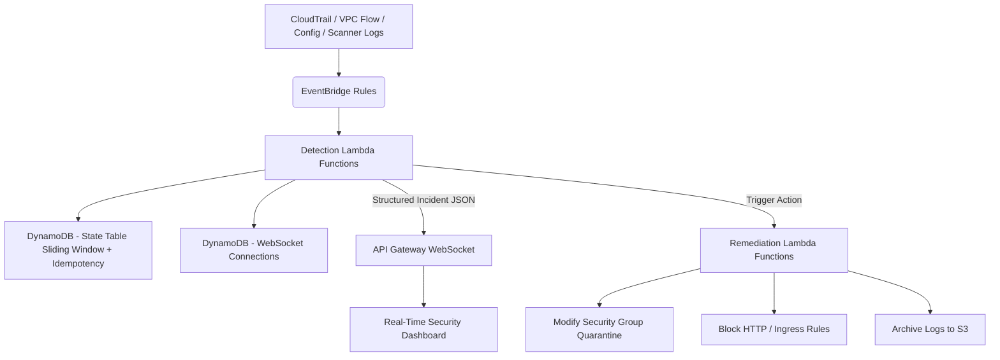

# AWS Security Automation Project

> **AWS 기반 실시간 보안 탐지 · 알림 · 자동대응(SOAR) 시스템 구축 프로젝트에서  
> 제가 직접 설계하고 구현한 부분만 정리한 포트폴리오 문서입니다.**

본 프로젝트는 AWS EventBridge, Lambda, CloudTrail, DynamoDB, API Gateway WebSocket 등을 활용해  
**보안 이벤트 실시간 탐지 → 알림 → 자동대응(Quarantine / Block / Logging)** 까지 수행하는  
SOAR 스타일의 자동화 시스템을 구축한 팀 프로젝트입니다.

► [Project Dashboard](https://seowon-aws-security-portfolio.vercel.app/)  
► [원본 프로젝트 레포](https://github.com/TeamLayer3/AWS-Security-Automation-Project) 

---

## 📌 1. 프로젝트 개요

AWS 환경에서 발생하는 주요 보안 이벤트를 자동으로 탐지하고 즉시 조치하는 **End-to-End 자동 대응 플랫폼**입니다.

### 구축 목표
- CloudTrail 기반의 실시간 탐지
- EventBridge를 통한 시나리오 별 분석 처리
- Lambda 기반 자동 대응 업무 구현
- DynamoDB & WebSocket 기반 실시간 알림 대시보드 구축
- EC2/DVWA 서버의 이상 트래픽 탐지 및 차단

---

## 📌 2. 제가 담당한 핵심 역할

프로젝트에서 제가 직접 개발/설계한 부분은 아래와 같습니다.

### 1) 탐지 Lambda 함수 개발
- Impossible Travel Login (불가능한 위치 로그인)
- CloudTrail Tampering 시도 감지
- DVWA 스캐너 이상 트래픽 감지 (4만 건 이상 요청 패턴)
- SSH World-Open(0.0.0.0/0) 규칙 생성 감지
- 잘못된 IAM 사용/AccessKey 기반 탐지

### 2) 자동 대응 플레이북 구현
- Open SSH 감지 → 보안 그룹 Quarantine 자동 적용  
- DVWA 공격 감지 → HTTP 차단 + 보안그룹 교체  
- CloudTrail Tamper → 로그 스냅샷 S3 저장
- 고위험 이벤트 종합 처리 → Incident 기록 및 실시간 송신

### 3) WebSocket 실시간 알림 구조 설계
- API Gateway WebSocket 연결 관리 테이블 설계
- Alert/Action 채널 분리 구조 설계 (EVENTS vs ACTIONS)
- Lambda에서 Dashboard로 Incident 구조화 전송

### 4) DynamoDB 상태 테이블 설계
- TTL 기반 Sliding Window 탐지 구조
- 멱등성(Idempotency) 보장을 위한 EventID 기반 저장

### 5) Dashboard 알림 포맷 개선
- 기존 undefined 값 제거
- incident 구조화 필드(source, region 등) 통일
- 알림 UX를 제품 형태로 정리

---

## 📌 3. 전체 아키텍처



### 이 아키텍처의 핵심 포인트

* **탐지 Lambda 9개 + 자동대응 Lambda 2개**로 구성된 실시간 관제
* **EventBridge → Lambda → DynamoDB → WebSocket → Dashboard** 전체 흐름을 구현
* **State Table(Window / Seen Events)** 로 과탐/중복 방지 설계
* **ACTIONS / EVENTS WebSocket 채널 분리** 구조 (서원이 직접 개선한 부분)
* Incident 포맷을 직접 통일(SOURCE·REGION·ACTION 등)하여 Dashboard 연동 안정화

---

## 📌 4. 내가 구현한 주요 탐지 로직 상세

### 1) Impossible Travel Login Detection (불가능한 이동 기반 의심 로그인)

* 최근 로그인 Geo(IP → 국가/위도/경도) 기록
* 직전 로그인 좌표와 거리 계산
* 이동 속도 기반 비정상 여부 판단
* 멱등성: `eventID` 기반 중복 처리
* Incident 전송: source=`signin.amazonaws.com`

### 2) CloudTrail Tampering Detection (트레일 조작 감지)

* StopLogging / DeleteTrail / UpdateTrail 관련 이벤트 감시
* 로그인 직후 60초 이내 시도 시 HIGH RISK 처리
* CloudTrail 관리 이벤트만 필터링
* Incident 전송: source=`cloudtrail.amazonaws.com`

### 3) DVWA 공격 스캐너 탐지 (4만+ 요청 패턴 기반)

* 5분 내 요청수 Threshold 기반 “스캐너” 판별
* User-Agent 기반 정규식 탐지 (ZAP / Acunetix 등)
* WebSocket 실시간 대시보드 전송
* 필요 시 HTTP 차단 Remediation로 연결됨
  
### 4) SSH World-Open 감지 (0.0.0.0/0 SSH 위험 규칙)

* AuthorizeSecurityGroupIngress 이벤트 감지
* 22/TCP + 0.0.0.0/0 패턴 분석
* 동일 계정 내 반복 개방 이벤트까지 처리
* Incident 전송 + 자동격리로 연결됨

### 5) Access Key 이상 사용 탐지 (GeoASN 기반)

* Access Key가 평소와 다른 ASN/국가에서 사용될 때 탐지
* IP 기반 Geo/ASN 조회
* 최근 사용 기록과 비교
* AWS IAM 사용자 도난 가능성 체크

### 6) 새로운 AccessKey 생성 감지 (신규 사용자 위험)

* CreateAccessKey 이벤트 기반
* 계정 남용/내부자 위험 탐지
* Incident 포맷 표준화 후 Dashboard로 전송

### 7) Config Compliance Change 기반 정책 위반 감지

* AWS Config의 Compliance 변동 때 HIGH RISK 변경 감지
* 위반 리소스 상세 정보 추출
* Incident Dashboard 전송

### 8) Security-Unusual-Region Login (평소 사용하지 않는 리전 접근)

* 최근 사용 Region 목록 추적
* 비정상 Region에서 로그인 발생 시 경고
* DynamoDB 기반 Sliding Window 사용

### 9) Positive Feedback (위험 규칙 삭제) → 보안 강화 이벤트 알림

* `RevokeSecurityGroupIngress`, `DeleteSecurityGroup` 감지
* SSH 월드오픈을 제거한 “양성 행동”만 필터링
* Dashboard에 “보안 강화 이벤트” 노출

---

## 📌 5. 자동 대응(Playbook)

### 1) OpenSSH World-Open → EC2 Quarantine 자동격리 (sg-open-ssh-ec2-remediation)

* SSH 0.0.0.0/0 감지
* 해당 인스턴스의 ENI 조회
* 기존 SG 제거 → Quarantine SG 자동 부착
* Real-time Dashboard에 “격리 성공” 표시
* Incident 전송: action=`QuarantineInstance`

### 2) DVWA 공격 감지 → HTTP 차단 (dvwa-remediation)

* 공격 패턴 감지 후 Remediation 호출
* SG의 80/443 ingress 차단
* 공격 IP 기반 로그 저장
* Dashboard에 “HTTP 차단 완료” 전송
* Action: `BlockHttpIngress`
* 
### 3) CloudTrail Tamper → 로그 스냅샷 S3 저장

* tamper 이벤트 감지 후 Remediation 연결
* CloudWatch 로그를 JSON 파일로 S3 저장(Archive)
* Dashboard에 알림 전송
* Action: `ArchiveTrailLogs`

---

## 📌 6. Incident 구조

```json
{
  "type": "incident",
  "event": "QuarantineInstance",
  "source": "ec2",
  "region": "us-east-1",
  "resource_id": "i-0ac2cbc9d6a8afc46",
  "status": "EXECUTED",
  "severity": "HIGH",
  "timestamp": "2025-11-28T08:30:00Z"
}
```
---

## 📌 7. 문제 해결 경험 (Troubleshooting)

### ⚠ WebSocket undefined 문제 해결

* Lambda 이벤트 구조 통일
* incident builder 함수 설계
* note 필드 제거, source/region 정상화

### ⚠ DynamoDB Hot Partition 이슈 가능성 완화

* TTL + pk 분리
* Sliding Window 방식 개선

### ⚠ 자동 대응 오작동

* Actor ARN / Window 기반 룰 필터링 추가
* Duplicate Event Skip 로직 적용

---

## 📌 8. 기술 스택

| 구분         | 기술                                   |
| ---------- | ---------------------------------------- |
| Cloud      | AWS EC2, Lambda, EventBridge, CloudTrail |
| Storage    | DynamoDB, S3                             |
| Networking | Security Group, VPC                      |
| Real-time  | API Gateway WebSocket                    |
| Infra      | IAM, KMS                                 |
| Language   | Python 3.x                               |
| Tools      | GitHub, CloudShell, PyCharm              |

---

## 📌 9. 원본 팀 프로젝트 링크

[AWS-Security-Automation-Project](https://github.com/TeamLayer3/AWS-Security-Automation-Project)

---

## 📌 10. About Me

**윤서원(Seowon Yoon)**  
Seeking : Privacy Manager / Security Automation / SOC  
Portfolio : https://seo1-ology.github.io/  
GitHub : [https://github.com/Wonyoon-Luciel](https://github.com/Wonyoon-Luciel)  
velog : https://velog.io/@seowon6766  
Email : seowon6766@gmail.com / lucielyoon1129@naver.com  
